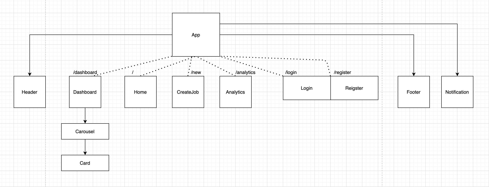

# RoleCall

A MERN stack application to keep track of, analyze, and apply for positions.

## Component Hierarchy



## Data Structure

```js
// User
{
  username: String,
  password_digest: String,
  email: String,
  roles: Role[],
  profile: Array[Enum["newest-found", "recent", "newest-archived", "featured", "newest-applied", "stale"]]
}

// Role
{
  user_id: User, 
  position: String,
  company: String,
  minSalary: Number, // optional
  maxSalary: Number, // optional
  timeline: [ 
    {
      status: Enum["Found", "Applied", "Phone Screen", "Technical Assessment", "Behavioral Interview", "Misc", "Rejected", "Offered"],
      when: Date,
    }
  ],
  link: String<url>,   
  source: String, // optional
  notes: String, // optional
  contact: String<email>, // optional
  referral: Boolean, // default: false 
  createdAt: Date,
  updatedAt: Date,
}
```

## v1 Sprint

#### MVP
- users can register for an account
- users receive e-mail upon registration 
- users can add a job to their personal tracker
- users can look at all jobs currently in tracker
- users can archive a given job
- users can update the application status of a given job
- users can update other details of a given job
- users can add widgets (i.e. featured) to profile for particular filters
